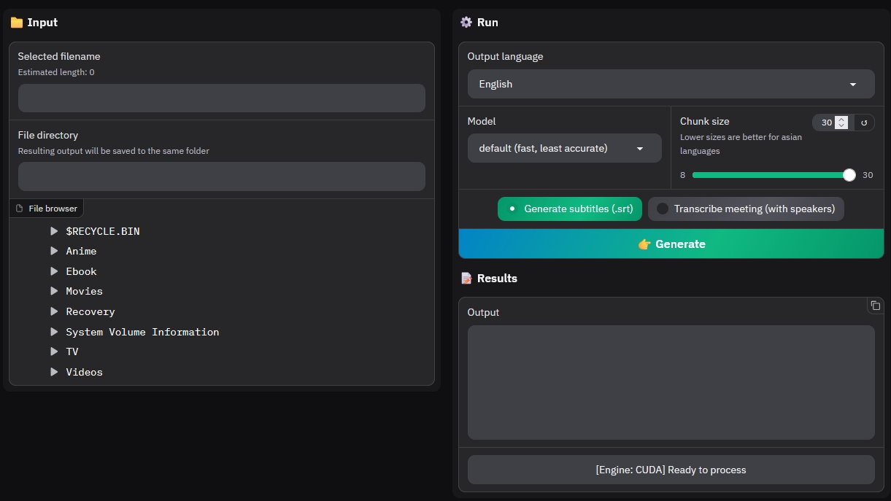

# **Subtitle Generator**

## Description

A user-friendly GUI to automatically generate subtitles (or meeting transcriptions) for any video/audio file on your local computer. It primarily uses [WhisperX](https://github.com/m-bain/whisperX), an advanced audio transcription system based on [Faster Whisper](https://github.com/SYSTRAN/faster-whisper) and supports both CPU and GPU processing.



## Requirements

- [CUDA Toolkit 12.8.0](https://developer.nvidia.com/cuda-toolkit-archive) (If using an NVIDIA GPU)
- For CPU-only mode, at least 8GB of RAM
- For GPU acceleration, x86/64 Intel, at least 8GB of VRAM, CUDA >= 12.8 (check your GPU stats with nvidia-smi)

## Installation and usage

You have two options, install locally or use docker (recommended). Installing with Docker has the advantage of persistence and customization with reverse proxies and volume mounts, etc. However, both options require first setting up your environment.

- ### Setup environment

  - Get started by first creating an .env file with the command `cp .env.sample .env`.
  - Update `MEDIA_FOLDER` to wherever your media is located. This is the only required ENV variable.
  - (Optional) If you would like to also transcribe meetings with speaker labels, generate a [huggingface token](https://huggingface.co/settings/tokens) and paste it into `HF_TOKEN`. Accept user agreements for downloading both [segmentation](https://huggingface.co/pyannote/segmentation-3.0) and [diarization](https://huggingface.co/pyannote/speaker-diarization-3.1) models from huggingface. No need to download the actual files.

- ### (Option 1) Local install

  Make sure you have [UV package manager](https://docs.astral.sh/uv/getting-started/installation/) installed.

  ```bash
  # Install all dependencies
  uv sync --locked

  # Start local server at http://localhost:7860
  uv run app.py
  ```

- ### (Option 2) Docker

  Make sure you are using the WSL2 backend if on Windows.

  ```bash
  # GPU mode (Nvidia CUDA)
  docker compose -f compose.cuda.yaml up -d

  # OR CPU mode
  docker compose -f compose.cpu.yaml up -d
  ```

  Now go relax and make a coffee, come back in 15min :)

Using the GUI (accessible at <http://localhost:7860>) is pretty self-explanatory. Pick a video/audio file to generate subtitles for. The subtitles file will be created in the same folder as the video you picked, with the same filename so all media players and backends like Jellyfin/Emby/Plex will detect it automatically.

When generating meeting transcriptions, the default speaker tags will be `SPEAKER_00, SPEAKER_01, ...`. Just type in whatever the actual names are, and hit replace. The names will be automatically updated.

> [!TIP]
> Processing a video for the first time will take significantly longer than usual, since the app needs to download all the models for pytorch/huggingface.
> Optionally, you can run `python preload-models.py` to download all models beforehand, and to test that everything is working.
> For docker, if you have already used whisper in the past, or setup the project locally already, you can set both local cache variables(`$TORCH_HOME` and `$HF_HOME`) to mount the models directly into the container to avoid redownloading everything. Search your OS specific details to determine where your local cache files are saved.

## Development

If you would like to help contribute to this repo, or simply want to customize the code for your own purposes, use the local setup above and make sure your code editor and/or terminal has the virtual environment activated.

> [!NOTE]
> If you would like to enforce linting and formatting rules while developing, run `pre-commit install` to install git hooks.
> If using Docker, use `docker compose up -d --build --force-recreate` to force docker to rebuild the image, otherwise it will always use the old image.
> If you are still having problems, use the `docker compose build --no-cache` to bypass the cache completely.
> Also, edit preload-models.py to add/remove caching of models you use frequently.

## Acknowledgements

Huge thanks to the following open-source projects. Much inspiration and code snippets have been borrowed from them. No AI was used or harmed in the making of this project.

- [WhisperX](https://github.com/m-bain/whisperX)
- [Kit-WhisperX](https://github.com/rgcodeai/Kit-Whisperx)
- [docker-whisperX](https://github.com/jim60105/docker-whisperX)

## LICENSE

WhisperX is distributed under [BSD-2](https://github.com/m-bain/whisperX/blob/main/LICENSE). All files in this repository are licensed under [MIT](LICENSE).
